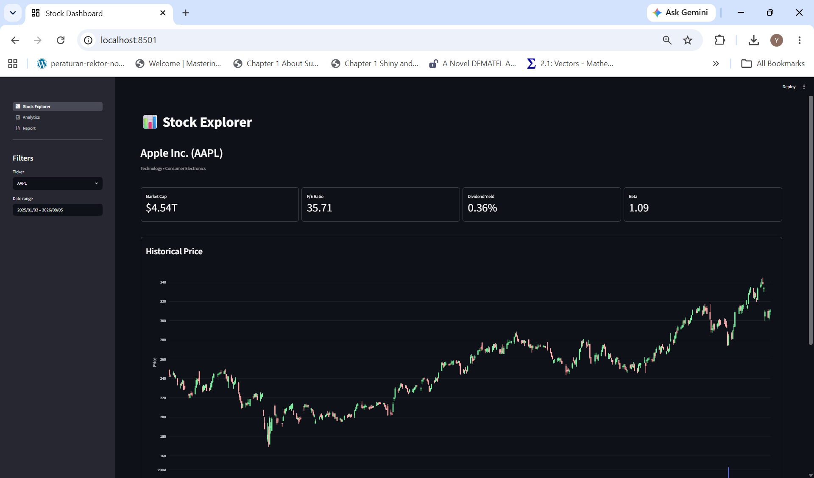
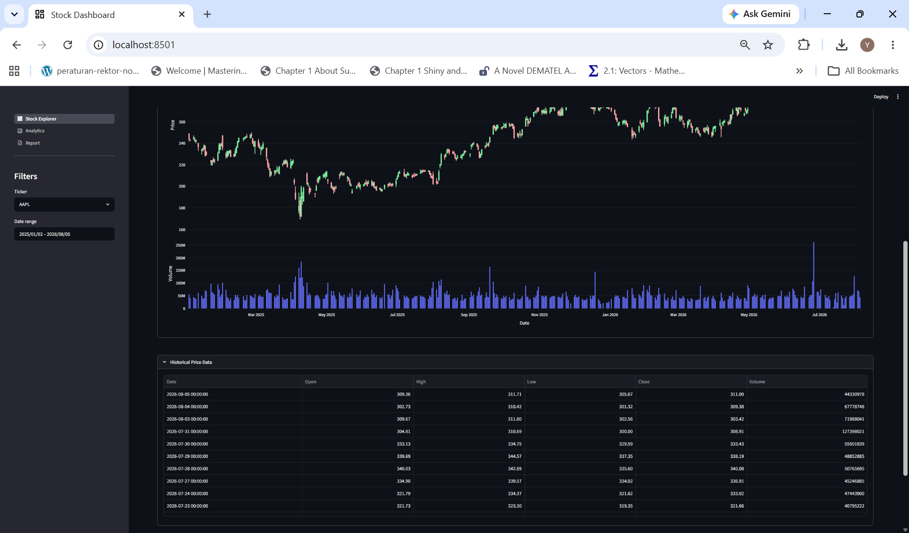
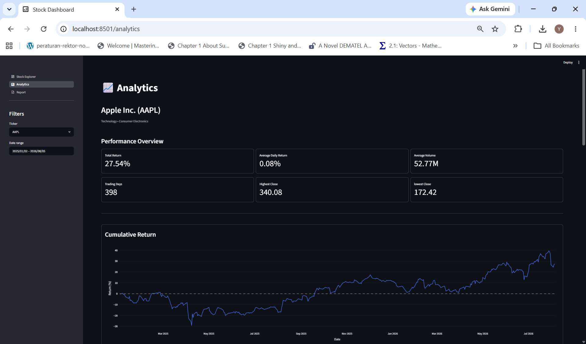
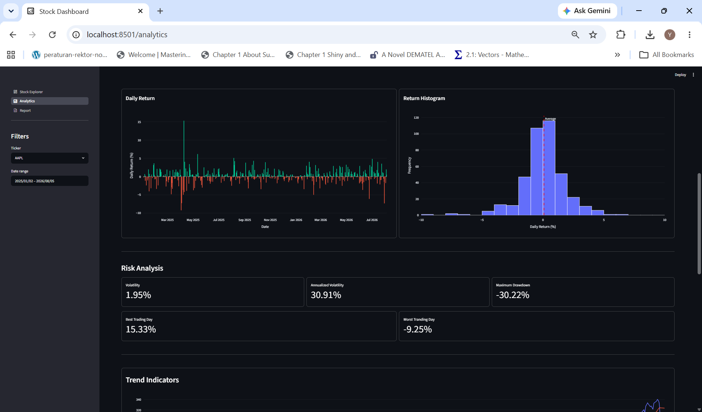
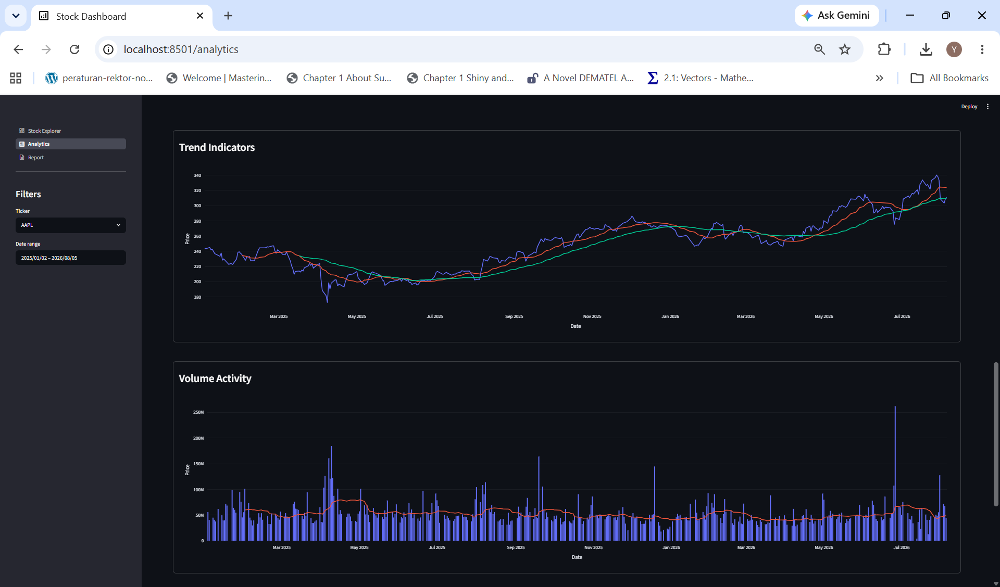
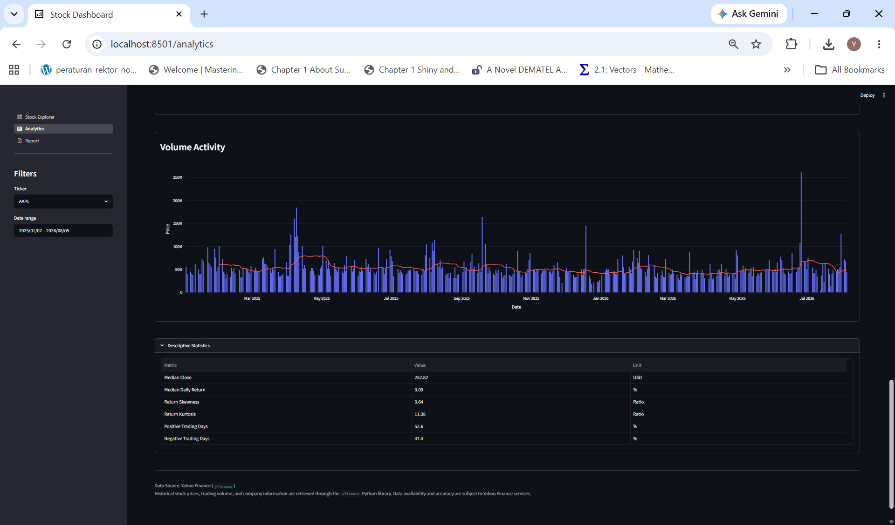
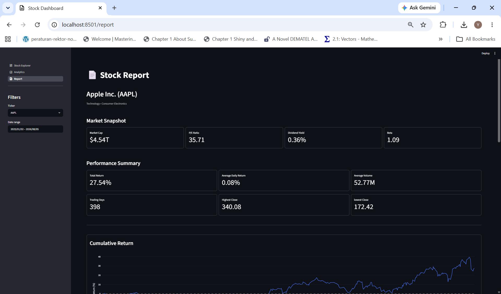
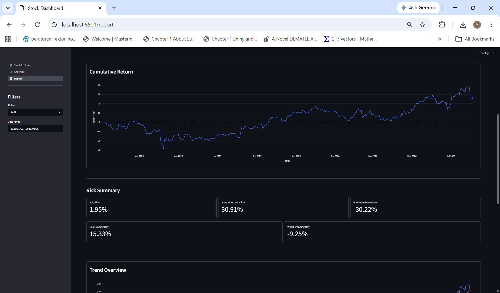
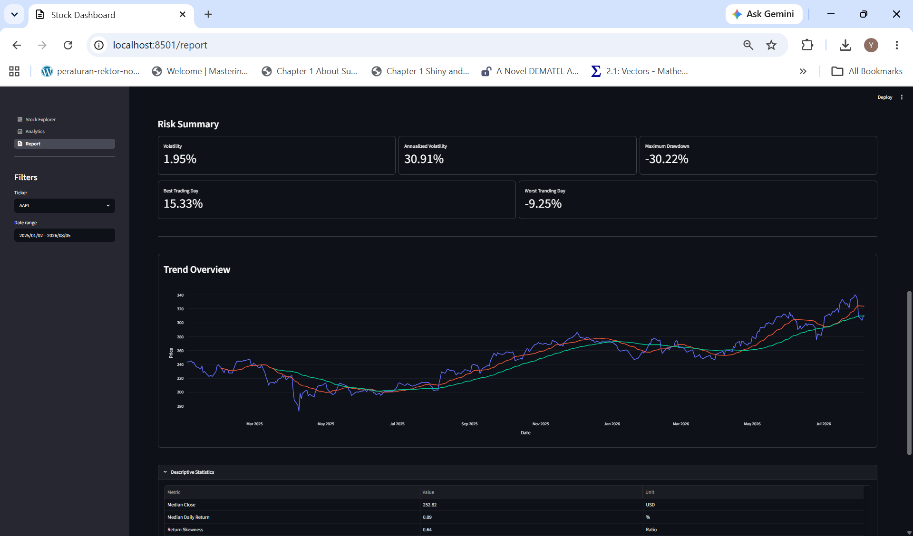
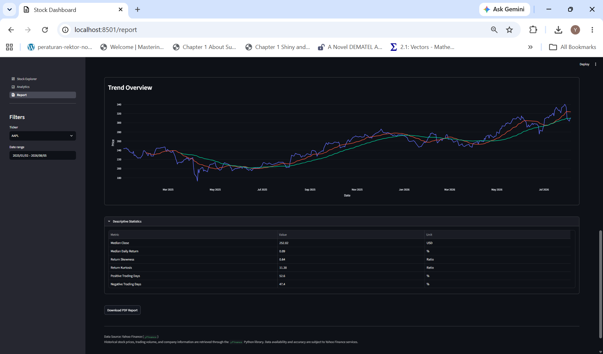

# 📈 Stock Analytics & Financial Intelligence Platform

An end-to-end stock analytics platform that transforms historical market data into financial insights through ETL processing, quantitative analysis, interactive visualization, and automated reporting.

The system supports exploratory financial analysis by combining market data management, financial metrics, risk analysis, statistical exploration, and PDF report generation in a unified dashboard.

---

## 🚀 Live Application

The dashboard is deployed and accessible online:

👉 **[Launch Stock Analytics Dashboard](https://my-stock-analytics-dashboard.streamlit.app/)**

---

## 🏗️ System Architecture

The application follows a layered architecture that transforms raw market data into analytical insights through ETL processing, database storage, quantitative analysis, visualization, and automated reporting.

```text
Financial Market Data
        │
        ▼
ETL Pipeline
        │
        ▼
PostgreSQL Database (Supabase)
        │
        ├── Stock Price Table
        ├── Ticker Metadata
        │
        ▼
Selected Stock Dataset
        │
        ├── KPI Engine
        │       ├── Performance Metrics
        │       ├── Risk Metrics
        │       └── Ticker Metrics
        │
        ├── Visualization Layer
        │       ├── Candlestick Chart
        │       ├── Cumulative Return
        │       ├── Return Analysis
        │       ├── Trend Indicators
        │       └── Volume Activity
        │
        ▼
Streamlit Dashboard Layer
        │
        ├── Interactive Dashboard
        ├── Data Tables
        └── PDF Reporting
```
---

## ✨ Key Features

### 📊 Historical Price Analysis

* Interactive candlestick visualization
* OHLC price and volume tracking
* Historical market exploration

### 📈 Performance Analysis

* Total and cumulative return calculation
* Average daily return and trading volume
* Trading period statistics
* Highest and lowest closing prices

### 📐 Return Analysis

* Daily return visualization
* Return distribution analysis
* Cumulative performance tracking

### ⚠️ Risk Analysis

* Daily and annualized volatility
* Maximum drawdown measurement
* Best and worst trading days

### 📉 Trend Analysis

* Price trend visualization
* Moving average indicators:
  * MA20 short-term trend
  * MA50 medium-term trend

### 📋 Statistical Exploration

* Central tendency analysis
* Return distribution statistics
* Skewness and kurtosis
* Positive and negative trading day analysis

### 📄 Automated Reporting

* PDF financial report generation
* KPI summaries
* Embedded analytical charts
* Downloadable reports

---

## 🧰 Tech Stack

* Python
* Streamlit
* Pandas
* NumPy
* Plotly
* Altair
* PostgreSQL
* Supabase
* SQLAlchemy
* psycopg2
* ReportLab
* Kaleido
* python-dotenv

---

## 🧹 Data Engineering

The data ingestion layer ensures reliable and consistent market data storage:

* Retrieves historical OHLCV market data
* Cleans and validates financial records
* Performs incremental synchronization
* Enforces database constraints for data integrity
* Prevents duplicate records using composite primary keys

---

## 🗄️ Database Design

The application uses PostgreSQL hosted on Supabase to store structured market data and company information.

### Stock Price Table

```text
stock_prices

ticker
date
open
high
low
close
volume
```

Primary key:

```text
(ticker, date)
```

This ensures each stock has only one record per trading day and prevents duplicate historical price entries.

```text
company_info

ticker
name
sector
industry
market_cap
trailing_pe
dividend_yield
beta
updated_at
```
Primary key:

```text
ticker
```
This stores company profile information and financial attributes used in KPI summaries and stock analysis.

---

## 🧠 Analytical Methodology

Financial metrics are derived from historical OHLCV data.

* Returns are calculated from historical closing prices.
* Volatility is measured from daily return variability and annualized using 252 trading days.
* Maximum drawdown measures the largest decline from a historical peak.
* Moving averages use rolling windows:
  * MA20 for short-term trends
  * MA50 for medium-term trends

---

## 📁 Project Structure

```text
StreamlitStockDashboard/
├── assets/
├── components/
├── modules/
│   ├── charts/
│   ├── grids/
│   ├── kpis/
│   ├── reports/
│   └── utils/
├── pages/
├── scripts/
├── src/
│   ├── db/
│   └── etl/
├── app.py
├── packages.txt
├── requirements.txt
├── .env.example
└── README.md
```

---

## 📸 Screenshots

### 📈 Stock Explorer

Historical price exploration with company overview, KPIs, and interactive charts.





### 📊 Analytics Dashboard

Performance, risk, trend, volume, and statistical analysis.







### 📄 Financial Report

Generated PDF report containing financial summaries and analytical charts.






---

## ▶️ How to Run Locally

### 1. Install Dependencies

```bash
pip install -r requirements.txt
```

### 2. Configure Environment Variables

Create `.env` based on `.env.example`.

Example:

```env
DB_USER=
DB_PASSWORD=
DB_HOST=
DB_PORT=6543
DB_NAME=
```

### 3. Run Backfill (First-Time Setup)

```bash
python -m scripts.run_financial_backfill
python -m scripts.run_stock_backfill
```

### 4. Start the Streamlit Application

```bash
streamlit run app.py
```

---

## ☁️ Deployment

The application is deployed on Streamlit Community Cloud.

Database credentials are configured through Streamlit Secrets:
```toml
DB_USER="your_user"
DB_PASSWORD="your_password"
DB_HOST="your_host"
DB_PORT="6543"
DB_NAME="postgres"
```

---

## 👤 Author

**Nurul Yakim Kazal**  
Lecturer, Department of Mathematics, Universitas Sam Ratulangi

Focus areas:

* Numerical Linear Algebra (academic)
* Data engineering & ETL systems
* Financial analytics dashboards
* Interactive data visualization
* Time-series analysis